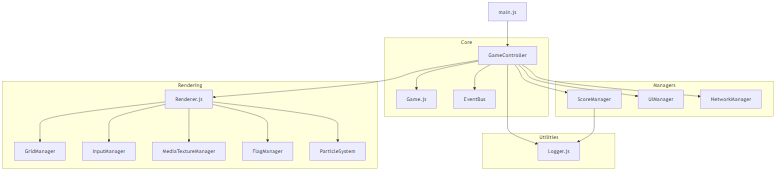
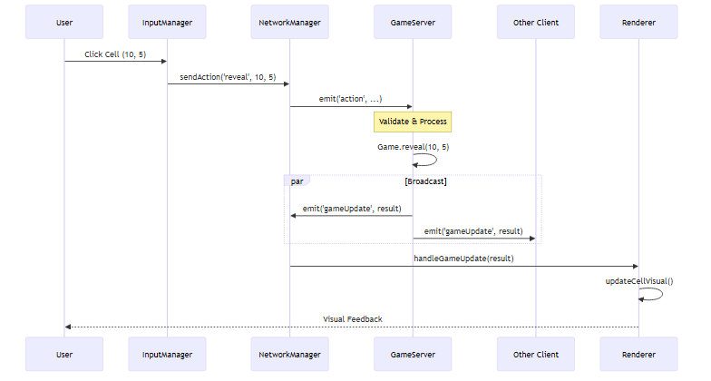
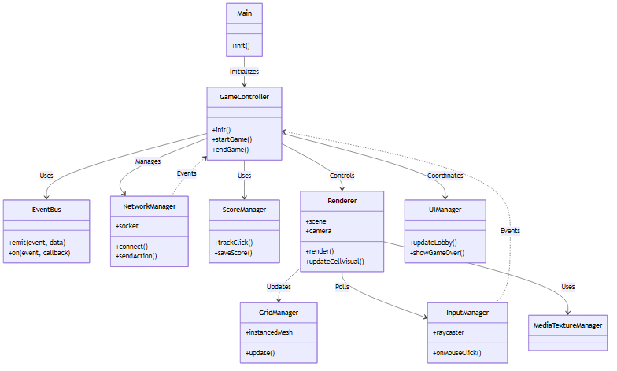
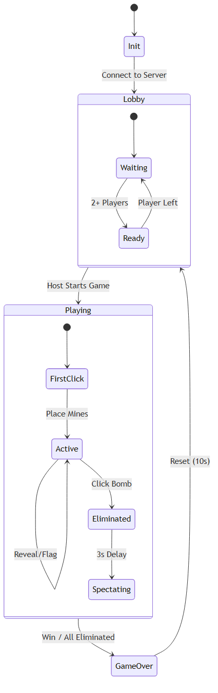

# 🏗️ Technical Architecture & Module Hierarchy

> **Version:** 2.0 (Feb 2026)
> **Status:** Active Refactoring

This document provides a technical overview of the **3D Video Minesweeper** codebase, its module hierarchy, and data flow.

---

### 1. File & Module Hierarchy

This graph represents the physical organization of the codebase and the primary responsibility of each module.

### 2. Event System & State Propagation

The application uses two primary event systems: **Socket.io** for network and **EventBus** for local decoupling.

### 3. Detailed Class Responsibilities (UML)

### 4. Multiplayer State Machine

Detailed lifecycle of a multiplayer session.

### 1. Core (`javascripts/core/`)
*   **`GameController.js`**: The central orchestrator. It connects the Game Logic, UI, Renderer, and Network. It delegates specific tasks to managers to avoid being a "God Object".
*   **`Game.js`**: Pure game logic (Grid state, Rules, Win/Loss conditions). No DOM/WebGL references.
*   **`EventBus.js`**: Pub/Sub system for decoupled communication (e.g., `Events.GAME_OVER`).

### 2. Rendering (`javascripts/rendering/`)
*   **`Renderer.js`**: The Three.js entry point. Manages the Scene, Camera, and Loop.
    *   *Refactoring Note*: Still contains some legacy logic for Grid creation that should be moved to `GridManager`.
*   **`GridManager.js`**: Handles the logic for the 3D Grid (`InstancedMesh`), cell visibility, and hover effects.
*   **`InputManager.js`**: Handles Mouse/Touch Raycasting and interaction events.
*   **`MediaTextureManager.js`**: Manages loading of Textures, Videos, and Fonts.
*   **`FlagManager.js`**: Manages 3D Flag instances and particle effects for flags.

### 3. Managers (`javascripts/managers/`)
*   **`ScoreManager.js`**: complex logic for Scoring, High Scores (LocalStorage), and **Click Analytics**.
*   **`UIManager.js`**: Manages HTML overlays (Menu, HUD, Modals) and DOM event listeners.

### 4. Network (`javascripts/network/`)
*   **`NetworkManager.js`**: Singleton wrapper around `Socket.io-client`. Handles connection, synchronized state, and events.

---

## 🔄 Data Flow

### 1. Local Single Player
1.  **Input**: User clicks canvas -> `InputManager` detects intersection.
2.  **Logic**: `InputManager` -> `Game.reveal(x,y)`.
3.  **Result**: `Game` returns a `Result` object (e.g., `{ type: 'reveal', changes: [...] }`).
4.  **Update**: `InputManager` passes result to `Renderer` -> `GridManager` updates visuals.
5.  **Analytics**: `ScoreManager` tracks the click.

### 2. Multiplayer (Coop/Vs)
1.  **Input**: User clicks -> `InputManager`.
2.  **Network**: `NetworkManager` sends action to Server (`socket.emit('action')`).
3.  **Server**: Authoritative `Game.js` on Node.js processes the move.
4.  **Broadcast**: Server emits `gameUpdate` to ALL clients.
5.  **Client Update**: `GameController` receives update -> updates local `Game` state -> `Renderer` updates visuals.

---

## 🛠 Technical Debt & Future Refactoring

### 1. Grid Logic Split
Currently, the responsibility for the Grid is split between `Renderer.js` (initial creation) and `GridManager.js` (updates).
*   **Goal**: Move ALL grid instantiation and management into `GridManager.js`.

### 2. Renderer size
`Renderer.js` is large (>1000 lines).
*   **Goal**: Extract `SceneSetup` (Lights, Camera, Skybox) into a helper class.

### 3. TypeScript
The project uses extensive JSDoc, but migrating to TypeScript would strictly enforce the interfaces between `GameController` and its Sub-Managers.
