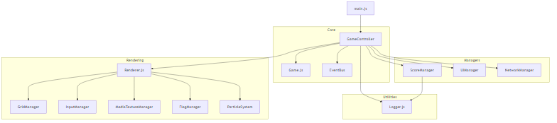
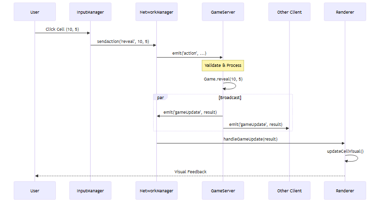
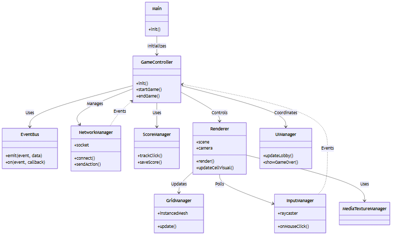
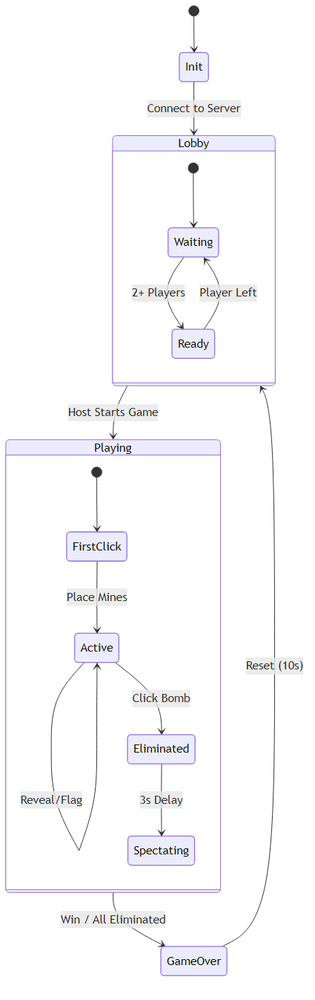

# 🏗️ Technical Architecture & Module Hierarchy

> **Version:** 3.4 (Feb 2026)
> **Status:** Active

This document provides a technical overview of the **3D Minesweeper** codebase, its module hierarchy, and data flow.

---

### 1. File & Module Hierarchy

This graph represents the physical organization of the codebase and the primary responsibility of each module.

### 2. Event System & State Propagation

The application uses two primary event systems: **Socket.io** for network and **EventBus** for local decoupling.

### 3. Detailed Class Responsibilities (UML)

### 4. Multiplayer State Machine

Detailed lifecycle of a multiplayer session.

### 1. Core (`javascripts/core/`)
*   **`GameController.ts`**: The central orchestrator. It connects the Game Logic, UI, Renderer, and Network via **EventBus**. It listens for `CELL_INTERACTION` and `NET_*` events to drive the game state. In solo mode, displays a **loading overlay** with live attempt counter during No-Guess board generation on first click.
*   **`Game.ts`**: Pure game logic (Grid state, Rules, Win/Loss conditions, Chord logic). No DOM/WebGL references.
*   **`EventBus.ts`**: Pub/Sub system for decoupled communication (e.g., `Events.GAME_OVER`, `Events.NET_GAME_START`, `Events.REQUEST_HINT_EXPLAIN`). Includes try/catch error isolation in `emit()` to prevent one bad listener from crashing others.

### 1b. Shared (`shared/`)
*   **`MinesweeperSolver.ts`**: Multi-strategy deterministic solver (Basic Rules → Subset Logic → Gaussian Elimination → Proof by Contradiction → Tank Solver → Global Mine Count). Used by both client (hint system) and server (No-Guess grid generation).
*   **`GaussianElimination.ts`**: Optimized matrix solver using flat `Int32Array` lookups and component windowing.
*   **`SolverBridge.ts`**: Unified solver interface with WASM acceleration and JS fallback. Lazy-loads the WASM module at startup; if unavailable, transparently delegates to `MinesweeperSolver.ts`. Exports `isSolvable()`, `generateSolvableBoard()`, `getHint()`, `getHintWithExplanation()`, `calculateNumbers()`.
*   **`solver-wasm/`**: Rust crate compiled to WebAssembly via `wasm-pack`. Contains a full port of all 6 solver strategies, board generation, and Gaussian elimination. Built artifacts live in `solver-wasm/pkg/` (gitignored).

### 2. Rendering (`javascripts/rendering/`)
*   **`Renderer.ts`**: The Three.js entry point (~370 lines). Manages Scene, WebGLRenderer, and animation loop. **Delegates** all domain logic to managers:
    *   **`GridManager.ts`**: Handles the 3D Grid (`InstancedMesh`), cell visibility, hover effects, and bomb textures.
    *   **`FlagManager.ts`**: Manages 3D Flag instances and particle effects for flags.
    *   **`CameraController.ts`**: Camera positioning, orbit controls, intro animation, and zoom-to-board.
    *   **`EndGameEffects.ts`**: Victory/defeat text billboards, confetti, and auto-return timer.
*   **`InputManager.ts`**: Handles input & raycasting. Uses a **ground-plane raycast** (`THREE.Plane` at Y=0) for click/double-click to resolve grid coordinates reliably (even on zero-scaled revealed cells), and `InstancedMesh` raycasting for hover highlights only. Supports three interaction types: `reveal` (left click), `flag` (right click), `chord` (double-click). **Decoupled**: Emits `CELL_INTERACTION` events instead of calling logic directly. Blocks clicks/flags during hint explanation mode (`hintMode`) while keeping camera controls active.
*   **`MediaTextureManager.ts`**: Manages loading of Textures, Fonts, and media resources.
*   **`ParticleSystem.ts`**: Flag particles, fireworks, and explosion effects. Uses reusable `_tempColor` to minimize GC pressure.

### 3. Managers (`javascripts/managers/`)
*   **`ScoreManager.ts`**: Scoring, High Scores (LocalStorage), and Click Analytics.
*   **`UIManager.ts`**: Manages HTML overlays (Menu, HUD, Modals) and DOM event listeners. Uses **toast notifications** (CSS-animated slide-in/out) instead of `alert()` for all user-facing messages.

### 3b. Internationalization (`javascripts/i18n.ts`)
*   **`i18n.ts`**: Lightweight i18n module (~190 keys FR/EN). Exports `t(key, params?)` for parameterized translations, `translateDOM()` for scanning `data-i18n` attributes, `setLang()`/`getLang()`/`getLocale()`/`initLang()`. `setLang()` dispatches a `langchange` CustomEvent so dynamic components can re-render. Language persisted in `localStorage`.

### 3c. Standalone Pages
*   **`analytics.html`**: Behavioral analytics dashboard (Chart.js). Uses `<script type="module">` importing from `i18n.ts`. Includes its own FR/EN language switcher and re-renders all charts/tables on language change.

### 4. Network (`javascripts/network/`)
*   **`NetworkManager.ts`**: Singleton wrapper around `Socket.io-client`. **Decoupled**: Emits `NET_*` events to `EventBus` instead of accepting callbacks.

---

## 🔄 Data Flow

### 1. Local Single Player
1.  **Input**: User clicks canvas -> `InputManager` raycasts a ground plane at Y=0 to resolve grid (x,y).
2.  **Event**: `InputManager` emits `CELL_INTERACTION` ({ x, y, type: 'reveal'|'flag'|'chord' }).
3.  **Logic**: `GameController` hears event -> calls `Game.reveal(x,y)`, `Game.toggleFlag(x,y)`, or `Game.chord(x,y)`.
4.  **Result**: `Game` returns a `Result` object.
5.  **Update**: `GameController` passes result to `Renderer` -> visuals update.

### 2. Multiplayer (Coop/Vs)
1.  **Input**: User clicks -> `InputManager` emits `CELL_INTERACTION`.
2.  **Orchestrator**: `GameController` detects multiplayer mode -> calls `NetworkManager.sendAction`.
3.  **Network**: `NetworkManager` emits socket event.
4.  **Server**: Authoritative `Game.js` processes move.
5.  **Broadcast**: Server emits `gameUpdate` to clients.
6.  **Client Listen**: `NetworkManager` emits `NET_GAME_UPDATE` to `EventBus`.
7.  **Update**: `GameController` hears event -> updates local `Game` -> updates `Renderer`.

---

## 🛠 Technical Debt & Future Refactoring

### 1. HUD Overlay System
`HUDController.js` could be expanded into a proper overlay rendering system for real-time game stats. The current `#hud-bar` (flexbox row with timer, score, mines counter) is functional but minimal.

### 2. Lobby Transition Animations
The multiplayer lobby panel switching (connecting → waiting → in-game) could benefit from slide-with-crossfade CSS transitions for a smoother UX.
